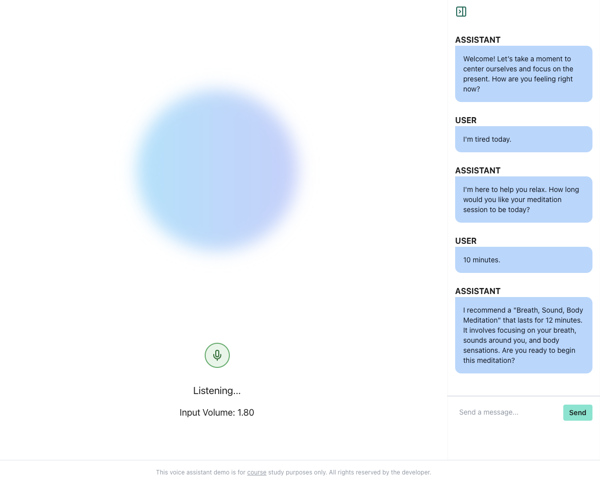

# Meditation Voice AI
A Next.js application that provides an interactive meditation experience through voice interactions and AI assistance.




## Features
- Voice-based interaction with AI assistant
- Text-to-speech capabilities using ElevenLabs/OpenAI
- Real-time voice recording and processing

## Tech Stack
- **Framework:** Next.js 14
- **Language:** TypeScript
- **Styling:** Tailwind CSS
- **UI Components:** Radix UI
- **Voice Processing:** 
  - OpenAI(whisper-1 & tts-1)
  - ElevenLabs
- **API Integration:** OpenAI-Assistants API

## Prerequisites
- Node.js 18+ 
- npm
- OpenAI API key
- Vercel/blob
- ElevenLabs API key(optional)

## Getting Started
1. Install dependencies:
```bash
npm install
```

2. Create a `.env.local` file in the root directory and add your API keys:
```
OPENAI_API_KEY=your_openai_api_key
ELEVENLABS_API_KEY=your_elevenlabs_api_key
ASSISTANT_ID=your_assistant_id
BLOB_READ_WRITE_TOKEN=your_vercel_blob_read_token
```
ELEVENLABS_API_KEY is required only when you want to use ELEVENLABS_API for text-to-speech

4. Run the development server:
```bash
npm run dev
```

5. Open [http://localhost:3000](http://localhost:3000) with your browser to see the result.
